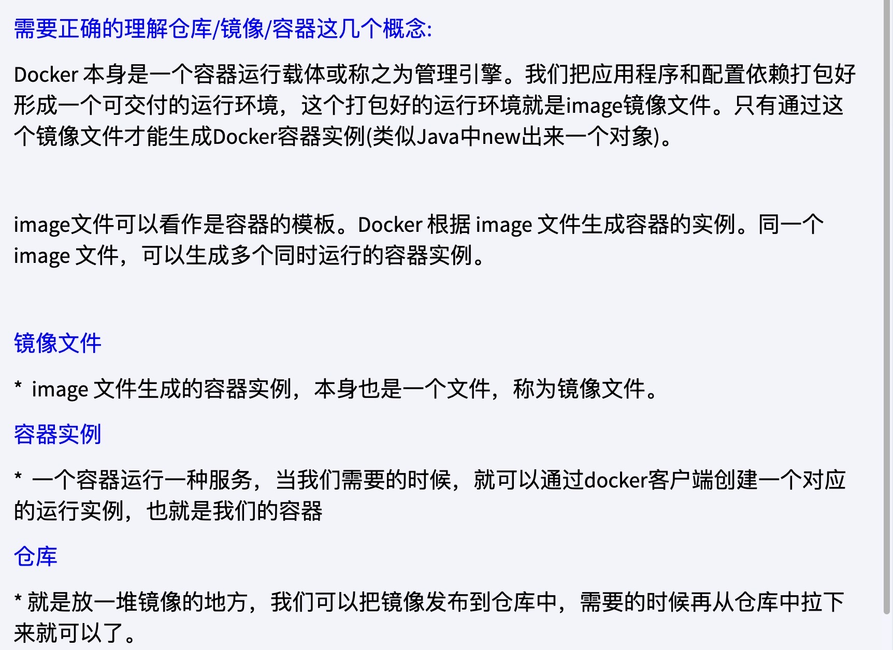

# Docker

## Docker是什么？

- [01-Docker概述 (yuque.com)](https://www.yuque.com/tmfl/cloud/rifotq)

docker 是go语言开发实现的，是一个开源的应用容器引擎，基于 Linux 内核轻量级虚拟机，属于操作系统层面的**容器虚拟化技术**。

docker的组成：



- 镜像（Image）就是一个**只读**的模板。镜像可以用来创建 Docker 容器，一个镜像可以创建很多容器

- 容器（Container）是用镜像创建的运行实例。类似java中类（镜像）与实例对象（容器）一样。

- 仓库（Repository）是集中存放镜像文件的场所。类似 github 仓库存放 git 项目一样。

  

## 解决什么问题？

部署项目：

​	docker出现前：在虚拟机上配置项目运行环境比如安装mysql+NGINX+Redis+java环境等等，如果分为开发，测试和正式环境，每个都要安装软件和配置环境，可能导致安装软件版本以及配置不一致导出出错，问题多、麻烦、容易出错，换台机器得重来一次，那么安装时原始环境是否可以一并复制过来？

​	docker出现后：开发环境运行正常，将源码、系统、软件及版本、环境配置等等打包成一个镜像文件，**一次使用到处运行**	

Linux容器技术的出现就解决了这样一个问题，而 Docker 就是在它的基础上发展过来的。将应用打成镜像，通过镜像成为运行在Docker容器上面的实例，而 Docker容器在任何操作系统上都是一致的，这就实现了跨平台、跨服务器。只需要一次配置好环境，换到别的机子上就可以一键部署好，大大简化了操作

### 传统虚拟机和容器

传统虚拟机（virtual machine）：

​	传统虚拟机技术基于安装在主操作系统上的虚拟机管理系统（如VirtualBox、VMware等），创建虚拟机（虚拟出各种硬件），在虚拟机上安装从操作系统，在从操作系统中安装部署各种应用。缺点：资源占用多、冗余步骤多、启动慢

Linux容器（Linux Container，简称LXC）：

​	Linux容器是与系统其他部分分隔开的一系列进程，从另一个镜像运行，并由该镜像提供支持进程所需的全部文件。容器提供的镜像包含了应用的所有依赖项，因而在从开发到测试再到生产的整个过程中，它都具有可移植性和一致性。

​		Linux容器不是模拟一个完整的操作系统，而是对进程进行隔离。有了容器，就可以将软件运行所需的所有资源打包到一个隔离的容器中。容器与虚拟机不同，不需要捆绑一整套操作系统，只需要软件工作所需的库资源和设置。系统因此而变得高效轻量并保证部署在任何环境中的软件都能始终如一的运行。

## 安装

### 在 CentOS 7 上安装

[官方CentOS安装教程](https://docs.docker.com/engine/install/centos/)
注意步骤4，步骤5

1. 查看系统信息是否是 CentOS 7以上

   ```shell
   # 查看系统版本
   cat /etc/redhat-release
   # 查看内核版本
   uname -r
   ```

2. 移除旧的版本

   ```shell
   sudo yum remove docker \
                   docker-client \
                   docker-client-latest \
                   docker-common \
                   docker-latest \
                   docker-latest-logrotate \
                   docker-logrotate \
                   docker-engine
   ```

   **备注：**
   \ 换行符

3. 安装必要系统工具

   ```shell
   sudo yum install -y yum-utils 
   ```

   **备注：**
   安装yum-utils包（提供yum-config-manager 实用程序）

4. 设置镜像仓库

   * 官方仓库【不推荐】

   ```shell
   sudo yum-config-manager --add-repo https://download.docker.com/linux/centos/docker-ce.repo
   ```

    * 阿里云仓库【推荐】

   ```shell
   sudo yum-config-manager --add-repo http://mirrors.aliyun.com/docker-ce/linux/centos/docker-ce.repo
   ```

5. 更新yum工具

   ```shell
   sudo yum makecache fast
   ```

6. 安装 Docker 包
   安装最新版本

   ```shell
   sudo yum install docker-ce docker-ce-cli containerd.io docker-buildx-plugin docker-compose-plugin
   ```

   **备注：**

    * docker-ce：Docker 引擎
    * docker-ce-cli：Docker 命令行工具
    * containerd.io：容器运行时
    * docker-buildx-plugin：Docker Buildx 插件
    * docker-compose-plugin：Docker Compose 插件
    *

7. 启动 Docker

   ```shell
   sudo systemctl start docker
   ```

   **备注：**systemctl 英文词组”system control“的缩写，用于管理系统服务。
   语法格式：systemctl 参数 服务常用参数：

    - start 启动服务
    - stop 停止服务
    - restart 重启服务
    - enable 使某服务开机自启
    - disable 关闭某服务开机自启
    - status 查看服务状态
    - list -units --type=service 列举所有已启动服务

8. 查看 Docker 版本，验证是否启动成功

   ```shell
   docker version
   ```

9. 测试

   ```shell
   sudo docker run hello-world
   ```

10. 停止 Docker

   ```shell
   sudo systemctl stop docker
   ```

## 卸载

1. 卸载安装包
   ```shell
   sudo yum remove docker-ce docker-ce-cli containerd.io docker-buildx-plugin docker-compose-plugin
   ```
2. 删除镜像、容器、配置文件等内容
   ```shell
   sudo rm -rf /var/lib/docker
   sudo rm -rf /var/lib/containerd
   ```
3. docker 文件位置及作用

    * /var/lib/docker：docker 镜像、容器、网络、卷等数据的保存目录
    * /etc/docker：docker 的配置文件目录，默认没有daemon.json文件
        * /etc/docker/daemon.json
    * /usr/bin/docker：docker 的二进制可执行文件
    * /usr/lib/systemd/system/docker.service：docker 的 systemd 配置文件
    * /var/run/docker.sock：docker 的 socket 文件

## 镜像加速

国内从 DockerHub 拉取镜像有时会遇到困难，因此需要配置镜像加速器。
阿里云镜像地址：[https://cr.console.aliyun.com/cn-hangzhou/instances/mirrors](https://cr.console.aliyun.com/cn-hangzhou/instances/mirrors)[参考地址](https://www.runoob.com/docker/docker-mirror-acceleration.html)

1. 登录阿里云，进入容器**镜像服务控制台**，选择左侧菜单栏的**镜像加速器**
2. 配置镜像加速器
   有两种方式：
   
    1. 直接复制粘贴
    2. 在/etc/docker下 创建、编辑 daemon.json 文件
   
       ```shell
       sudo touch /etc/docker/daemon.txt
       sudo vim /etc/docker/daemon.json
       ```
       
       内容如下：
       
       ```json
       {
         "registry-mirrors": ["https://自己的编码.mirror.aliyuncs.com"]
       }
       ```
3. 重启 Docker 服务

```shell
sudo systemctl daemon-reload
sudo systemctl restart docker
```

4. 验证是否配置成功

```shell
sudo docker info
```

## Docker 常用命令

- docker 启动类命令

    - systemctl start docker：启动 Docker
    - systemctl stop docker：停止 Docker
    - systemctl restart docker：重启 Docker
    - systemctl status docker：查看 Docker 状态
    - systemctl enable docker：设置 Docker 开机自启
    - systemctl disable docker：取消 Docker 开机自启
- docker 信息类命令

    - docker version：查看 Docker 版本信息
    - docker info：查看 Docker 系统信息
    - docker help：查看 Docker 帮助信息
    - docker 具体命令 --help：查看docker具体命令的帮助信息
- 镜像命令

    - docker images：查看本地镜像，
    - docker search 镜像名：搜索镜像
    - docker pull 镜像名：拉取镜像（ docker pull 镜像名:版本号，没有表示:last拉取最新版本）
    - docker run 镜像名：运行镜像创建一个新容器
    - **docker run [OPTIONS] IMAGE [COMMAND] [ARG...] 运行镜像创建一个新容器**

        - OPTIONS
        - -d：后台运行容器，并返回容器ID
        - -i：以交互模式运行容器，通常与 -t 同时使用
        - -t：为容器重新分配一个伪输入终端，通常与 -i 同时使用
        - -p：端口映射，格式为：主机(宿主)端口:容器端口
        - -v：挂载数据卷，格式为：主机(宿主)目录:容器目录
        - --name=容器名称：为容器指定一个名称
        - -rm：容器退出时自动删除容器文件
        - -e：设置环境变量
        - -link：链接到另一个容器
          例如：

      ```shell
      # 使用镜像centos:latest以交互模式启动一个容器,在容器内执行/bin/bash命令
      # Docker 以 centos 镜像创建一个新容器，然后在容器里执行 /bin/bash 命令
      docker run -it centos /bin/bash
      ```

      参数说明：- -i: 交互式操作。

        - -t: 终端。
        - centos : centos 镜像（也可以centos:版本号）。
        - /bin/bash：放在镜像名后的是命令，这里我们希望有个交互式 Shell，因此用的是 /bin/bash。
        - **要退出终端，直接输入 exit或者Ctrl+D即可。（使用exit退出容器会停止运行，ctrl+p+q容器不停止）**
    - docker rmi 镜像ID：删除镜像(强制单个：docker rmi -f 镜像ID，)
    - docker commit 容器ID 新镜像名：提交容器生成镜像
    - **docker build -t 镜像名 Dockerfile所在目录：根据 Dockerfile 构建镜像**
    - docker push 镜像名：推送镜像到 DockerHub
    - docker tag 镜像ID 新镜像名：给镜像打标签
    - docker history 镜像名：查看镜像的历史记录
    - docker save -o 镜像名.tar 镜像名：导出镜像
    - **docker load -i 镜像名.tar：导入镜像**
    - docker system df：查看镜像占用空间
- 容器命令

    - docker ps：查看正在运行的容器
    - docker ps -a：查看所有容器，列出当前所有正在运行的容器+历史上运行过的容器
        - -l :显示最近创建的容器。
        - -n：显示最近n个创建的容器。
        - -q :静默模式，只显示容器编号。
    - docker start 容器ID：启动容器
    - docker stop 容器ID：停止容器
    - docker kill 容器ID：强制停止容器
    - docker restart 容器ID：重启容器
    - docker attach 容器ID：进入容器（使用exit退出容器会停止）
    - **docker exec -it 容器ID /bin/bash：进入容器【推荐】（使用exit退出容器不会停止，exec是在容器中打开新的终端，并且启动新的进程）**
      redis一般先用 docker run -d IMAGE 启动程序，然后用 docker exec -it CONTAINER /bin/bash 进入容器，然后执行 ps -ef
      查看进程，然后执行 kill -9 PID 杀掉进程，最后执行 exit 退出容器。
    - docker rm 容器ID：删除已停止的容器
        - docker rm -f $(docker ps -aq)：删除所有容器
        - docker rm -f $(docker ps -a -q)：删除所有容器
    - docker logs 容器ID：查看容器日志
    - docker inspect 容器ID：查看容器详细信息
    - docker top 容器ID：查看容器内运行的进程
    - docker cp 容器ID:容器内路径 主机路径：将容器内文件拷贝到主机
    - 导入和导出容器
        - docker export 容器ID > 容器.tar：导出容器
        - docker import 容器.tar 镜像名：导入容器
    - docker port 容器ID：查看容器端口映射
    - docker stats 容器ID：查看容器资源占用情况
    - docker diff 容器ID：查看容器文件变化

## docker生成镜像

### 相关命令

1. docker commit 容器ID 新镜像名：提交容器生成镜像
2. docker commit -m="提交的描述信息" -a="作者" 容器ID 镜像名:版本号
3. docker build -t 镜像名 Dockerfile 所在目录：根据 Dockerfile 构建镜像

### 以在ubuntu加入vim功能为示例

1. 从 hub.docker.com 拉取 ubuntu 镜像

```shell
docker pull ubuntu
```

2. 运行 ubuntu 镜像

```shell
docker run -it ubuntu /bin/bash
```

3. 在容器中安装 vim
   默认Ubuntu镜像中没有vim，所以需要在容器中安装vim 测试：vim a.text

```shell
    # 先更新管理工具
    apt-get update
    # 安装 vim 
    apt-get -y install vim
```

4. 退出容器

```shell
    exit
```

5. 提交容器生成镜像

```shell
    # docker commit -m="提交的描述信息" -a "作者" 容器ID 镜像名:版本号
    docker commit -m="add vim" -a "zhangsan" 1d1f1f1f1f1f ubuntu:v1
```

6. 查看镜像

```shell
    docker images
```

7. 运行镜像

```shell
    docker run -it ubuntu:v1 /bin/bash
```

8. 测试vim

```shell
    vim a.text
```

## 本地镜像发布到阿里云

接以上生成本地镜像流程，将本地镜像上传到阿里云

1. 进入阿里云`容器镜像服务`
2. 创建`命名空间`
3. 创建`镜像仓库`
4. 进入操作`管理`界面获取脚本（得到步骤5、步骤6的命令）
5. 将镜像推送到阿里云
    1. 登录阿里云Docker Registry
   ```shell
    docker login --username=dq_hyf9527 registry.cn-hangzhou.aliyuncs.com
   ```
    2. 将镜像推送到Registry
   ```shell
    docker tag 镜像ID registry.cn-hangzhou.aliyuncs.com/命名空间/镜像名:版本号
    docker push registry.cn-hangzhou.aliyuncs.com/命名空间/镜像名:版本号
   ```
6. 从阿里云下载镜像
   ```shell
   docker pull registry.cn-hangzhou.aliyuncs.com/vensst/myubuntu:[镜像版本号]
   ```

## 本地镜像发布到私有库

Docker Registry是官方提供的工具，可以用于构建私有镜像仓库

1. 下载 Docker Registry
   ```shell
   docker pull registry
   ```
2. 运行 Docker Registry 生成私有docker hub镜像仓库
   ```shell
    docker run -d -p 5000:5000 -v /vensst/myregistry/:/tmp/registry --privileged=true registry
   ```
   docker inspect 容器ID：查看容器详细信息
3. 以 ubuntu 安装 ifconfig 命令为例，将镜像推送到私有镜像仓库
    1. 下载并运行ubuntu镜像
   ```shell
    docker pull ubuntu
    docker run -it ubuntu /bin/bash
   ```

    2. 安装 ifconfig
   ```shell
    apt-get update
    apt-get install net-tools
    # 验证
    ifconfig
   ```

    3. commit 容器生成镜像
   ```shell
    docker commit -m="add ifconfig" -a="yfhu" 1d1f1f1f1f1f myubuntu:1.2
   ```
    4. 运行私有镜像仓库
   ```shell
    docker run -it myubuntu:1.2 /bin/bash
    ifconfig
   ```

4. 使用curl 验证私有库有什么镜像

```shell
curl -XGET http://81.69.44.160:5000/v2/_catalog
# {"repositories":[]} 说明没有镜像
```

5. 将新镜像修改符合私服规范的tag
   公式：docker tag 镜像:Tag Host:Port/Repository:Tag

```shell
docker tag myubuntu:1.2 81.69.44.160:5000/myubuntu:1.2
```

6. 修改配置文件使之支持http

```shell
# 查看配置文件
cat /etc/docker/daemon.json
# 修改配置文件
vim /etc/docker/daemon.json
```

新增"insecure-registries": ["192.168.111.162:5000"]

```json
{
  "registry-mirrors": [
    "https://aa25jngu.mirror.aliyuncs.com"
  ],
  "insecure-registries": [
    "192.168.111.162:5000"
  ]
}
```

修改好重启docker服务

```shell
systemctl restart docker
```

7. 将镜像推送到私有镜像仓库

```shell
 docker push 81.69.44.160:5000/yfhuubuntu:1.2
```

8. 使用curl 验证私有库有什么镜像2

```shell
curl -XGET http://81.69.44.160:5000/v2/_catalog
```

9. 从私有镜像仓库下载镜像

```shell
docker pull 81.69.44.160:5000/yfhuubuntu:1.2
```

## docker 容器数据卷

Docker容器数据卷（Volumes）是Docker中用于持久化和共享数据的一种机制。在Docker容器的生命周期中，容器内部的文件系统是临时性的，当容器停止或删除时，其所有更改通常都会丢失。为了确保重要数据能够跨容器持久存储，并且能够在多个容器之间共享，Docker引入了数据卷的概念。

docker run -it --privileged=true -v /宿主机绝对路径目录:/容器内目录 镜像名

## docker 安装 nginx

### 下载镜像前配置

目的是将nginx的配置文件、日志文件、网站文件挂载到宿主机的目录

```shell
# 创建挂载目录 -p 递归创建
mkdir -p /vensst/nginx/conf
mkdir -p /vensst/nginx/log
mkdir -p /vensst/nginx/html
```

### 拉取镜像

```shell
docker pull nginx
```

### 运行镜像

```shell
docker run -d -p 9001:80 --name nginx-vensst nginx
```

**备注：**

- nginx 文件位置说明
    - nginx镜像默认的配置文件在容器的`/etc/nginx/nginx.conf`
    - nginx镜像默认的配置文件在容器的`/etc/nginx/conf.d`
    - nginx镜像默认的网站文件在容器的`/usr/share/nginx/html`
    - nginx镜像默认的日志文件在容器的`/var/log/nginx`
    - nginx镜像默认的端口是80
- 查看方式
    - 进入容器  
      docker exec -it nginx-vensst /bin/bash
    - 修改nginx配置文件  
      vim /etc/nginx/nginx.conf
    - 重启nginx  
      nginx -s reload

### 拷贝容器文件到宿主机

```shell
# 将容器nginx.conf文件复制到宿主机
docker cp nginx-vensst:/etc/nginx/nginx.conf /vensst/nginx/nginx.conf
# 将容器conf.d文件夹下内容复制到宿主机
docker cp nginx-vensst:/etc/nginx/conf.d /vensst/nginx/conf.d
# 将容器中的html文件夹复制到宿主机(部署项目放到这里)
docker cp nginx-vensst:/usr/share/nginx/html /vensst/nginx/
```

### 创建容器

删除容器,或者使用命令 docker rm -f nginx-vensst 直接删除正在运行的 nginx-vensst 容器

```shell
# 直接执行docker rm nginx或者以容器id方式关闭容器
# 找到nginx对应的容器id
docker ps -a
# 关闭该容器
docker stop nginx-vensst
# 删除该容器
docker rm nginx-vensst
```

创建容器

```shell
docker run -d -p 9001:80 --name nginx-vensst --privileged=true -v /vensst/nginx/conf/nginx.conf:/etc/nginx/nginx.conf -v /vensst/nginx/conf/conf.d:/etc/nginx/conf.d -v /vensst/nginx/html:/usr/share/nginx/html -v /vensst/nginx/log:/var/log/nginx nginx
```

## docker 安装 jenkins

### 下载镜像前配置

目的是将jenkins的配置文件、日志文件、网站文件挂载到宿主机的目录

```shell
# 创建挂载目录 -p 递归创建
mkdir -p /vensst/jenkins/jenkins_home
# 文件授权，不授权的话无法启动运行 jenkins 参考：https://www.linuxcool.com/chmod
chmod 777 /vensst/jenkins/jenkins_home
```

### 拉取镜像

::: tip
- jenkins停用，选择 jenkins/jenkins 或 jenkinsci/blueocean
:::

```shell
docker pull jenkins/jenkins:lts-jdk11
```

### 运行镜像

```shell
docker run -d -p 7227:8080 -p 50000:50000 --name jenkins-vensst --privileged=true -v /vensst/jenkins/jenkins_home:/var/jenkins_home jenkins/jenkins:lts-jdk11
```

**备注：**

- 8080端口是jenkins的web访问端口,50000端口是jenkins的代理端口
- jenkins 文件位置说明
    - jenkins镜像默认的配置文件在容器的`/var/jenkins_home`
    - jenkins镜像默认的日志文件在容器的`/var/log/jenkins`
    - jenkins镜像默认的端口是8080

### 获取密码登录（首次登录）

```shell
vim /vensst/jenkins/jenkins_home/secrets/initialAdminPassword
```

### 问题与解决

- 插件安装失败
  - 原因：一般是因为jenkins与插件版本不适应 
  - 解决：系统管理->插件管理->高级->升级站点->修改对应的url（[查询地址](https://mirrors.tuna.tsinghua.edu.cn/jenkins/updates/)）->提交->重启jenkins


### 在jenkins中安装jdk

- 系统管理->全局工具配置->JDK->新增JDK->自动安装->输入版本号->保存
- 1:别名随便取 2:版本id是8u开头 3.此处会有登录提示需要配置oracle账号


### 在jenkins中安装maven

- 系统管理->全局工具配置->Maven->新增Maven->自动安装->选择版本->保存

